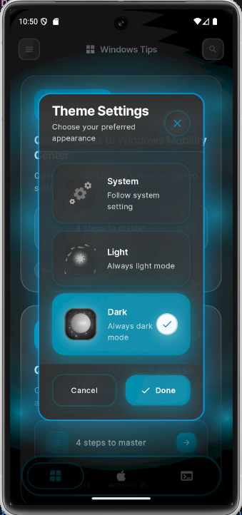
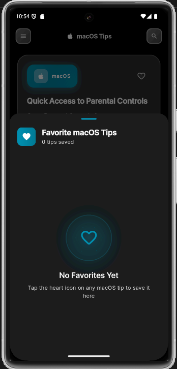
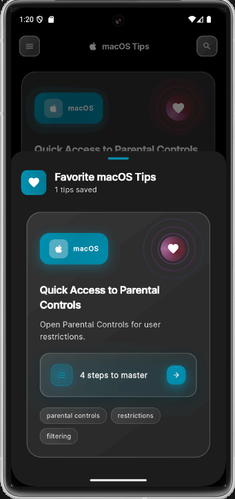
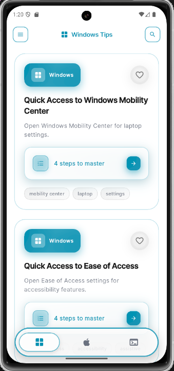
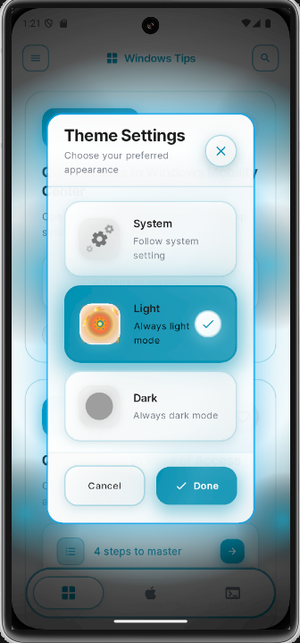
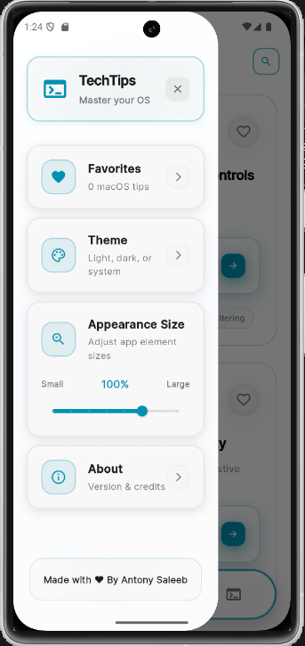
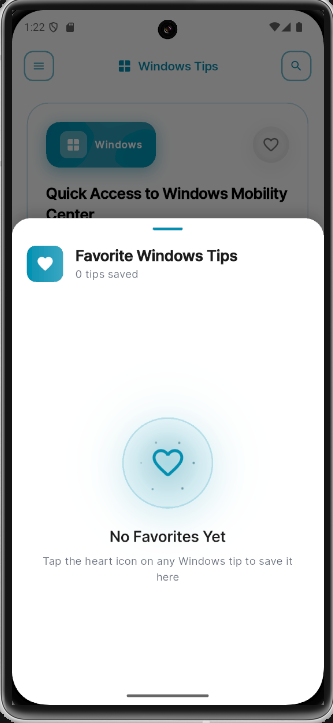

  

# TechTips - OS Tips & Tricks App

A comprehensive Flutter mobile application focused on productivity tips and keyboard shortcuts across different operating systems, designed to help users master their workflow efficiency.

## Project Overview

**Purpose**: The app serves as a productivity tool for power users, providing quick access to essential keyboard shortcuts and system tips for Windows, macOS, and Linux operating systems.

**Technology Stack**:
- Flutter for the UI framework
- Dart as the programming language
- Provider for state management
- Clean Architecture with MVVM pattern
- Various libraries for responsive design, animations, and local data persistence

## Core Features

1. **Three Main Operating Systems**:
   - **Windows**: Essential Windows shortcuts and productivity tips
   - **macOS**: Mac-specific keyboard shortcuts and system tricks
   - **Linux**: Command-line shortcuts and terminal productivity tips

2. **Implemented Features**:
   - **Smart Search**: Find tips quickly with relevance-based search
   - **Favorites System**: Save and organize your favorite shortcuts
   - **Dark/Light Themes**: Beautiful theme switching with smooth transitions
   - **Responsive Design**: Optimized for phones, tablets, and desktop screens

3. **For Each Operating System**:
   - Comprehensive tip database with step-by-step instructions
   - Interactive tip cards with favorite functionality
   - Search and filtering capabilities
   - Professional UI with smooth animations

4. **UI/UX Features**:
   - Modern, responsive design with professional styling
   - Dark/light theme support
   - Smooth animations and transitions
   - Bottom navigation with OS-specific tabs
   - Glassmorphism effects and premium design elements

## Download & Test the App

You can download and test the latest APK release here:

[Download APK - Coming Soon](https://github.com/tony-saleeb/techtips/releases)

## Educational Value

The application is designed to:
1. Help users discover new productivity shortcuts they didn't know
2. Allow users to quickly reference essential OS shortcuts
3. Provide organized access to system-specific tips and tricks
4. Serve as a practical tool for improving workflow efficiency

## App Screenshots

A quick look at the app's clean UI in both light and dark themes.

<h4>🌙 Dark Theme</h4>

 

<h4>🌞 Light Theme</h4>

 

## Getting Started with Development

This project is built with Flutter. To get started:

1. Make sure you have Flutter installed (https://docs.flutter.dev/get-started/install)
2. Clone this repository
3. Run `flutter pub get` to install dependencies
4. Run `flutter packages pub run build_runner build` to generate code
5. Run `flutter run` to launch the app on a connected device or emulator

For more information on Flutter development:

- [Lab: Write your first Flutter app](https://docs.flutter.dev/get-started/codelab)
- [Cookbook: Useful Flutter samples](https://docs.flutter.dev/cookbook)
- [Flutter documentation](https://docs.flutter.dev/)