

  

# Numerical Analysis App

A comprehensive Flutter mobile application focused on numerical analysis methods, designed to help users understand and apply various numerical algorithms.

## Project Overview

**Purpose**: The app serves as an educational tool for numerical methods, providing both theory and interactive implementations of common numerical algorithms.

**Technology Stack**:
- Flutter for the UI framework
- Dart as the programming language
- Flutter Riverpod for state management
- Various libraries for rendering mathematical charts (fl_chart), parsing mathematical expressions (math_expressions), and UI enhancements

## Core Features

1. **Two Main Categories of Numerical Methods**:
   - **Root Finding Methods** (Chapter 1): Techniques for finding solutions to equations of the form f(x) = 0
   - **Linear Algebra Methods** (Chapter 2): Algorithms for solving systems of linear equations

2. **Implemented Numerical Methods**:
   - **Root Finding**: Bisection, False Position, Simple Fixed Point, Newton's Method, Secant Method
   - **Linear Algebra**: Gauss Elimination, LU Decomposition, Gauss-Jordan, Cramer's Rule

3. **For Each Method**:
   - Detailed input screens with parameter configuration
   - Step-by-step solution visualization
   - Graphical representation (where applicable)
   - Mathematical explanations and debugging information

4. **UI/UX Features**:
   - Modern, responsive design with Material 3 styling
   - Dark/light theme support
   - Smooth animations and transitions
   - Interactive elements for better learning experience

## Download & Test the App

You can download and test the latest major APK release here:

[Download APK v1.0.0](https://github.com/tony-saleeb/BT2/releases/download/v1.0.0/BT2.apk)

## Educational Value

The application is designed to:
1. Help students visualize and understand numerical methods
2. Allow users to experiment with different parameters and see their effects
3. Provide detailed breakdowns of solution steps for educational purposes
4. Serve as a practical tool for solving numerical problems

## App Screenshots

A quick look at the app's clean UI in both light and dark themes.

<h4>🌙 Dark Theme</h4>

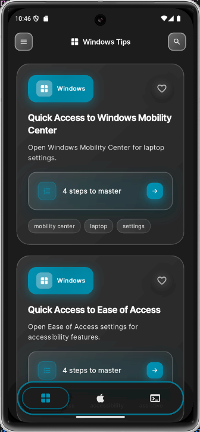
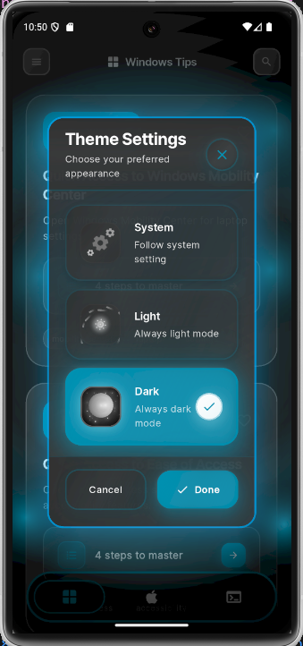
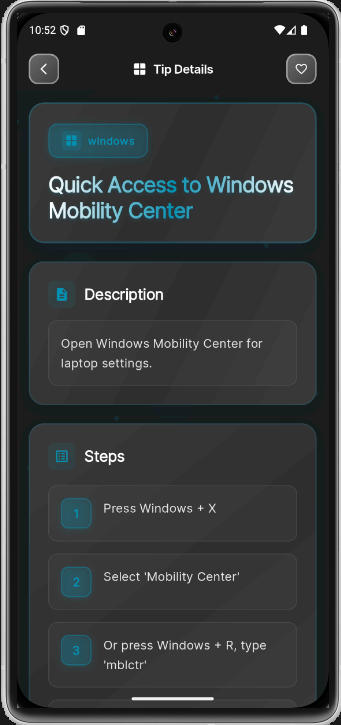
 
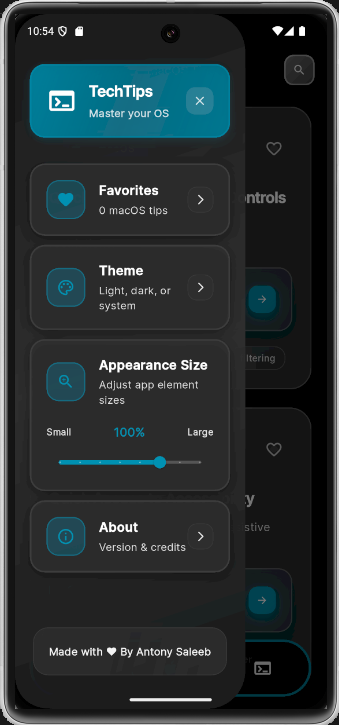
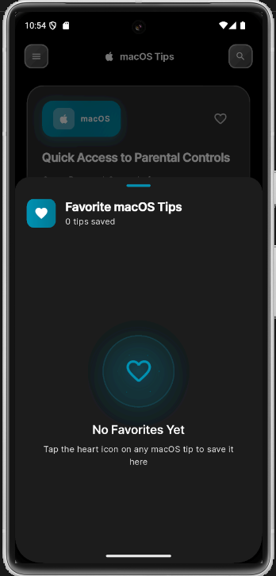
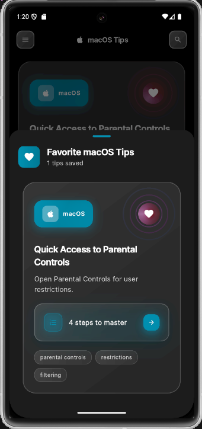

<h4>🌞 Light Theme</h4>

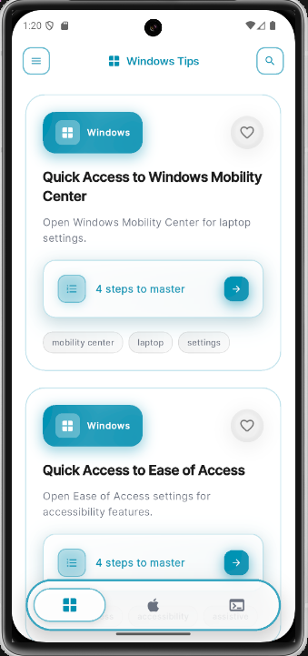
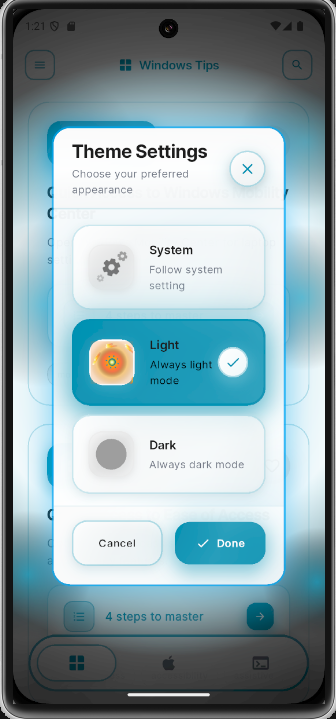
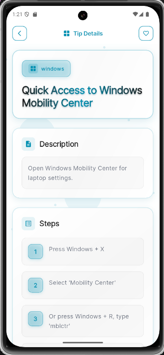
 
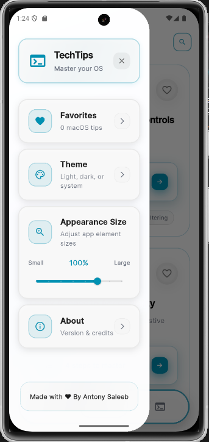
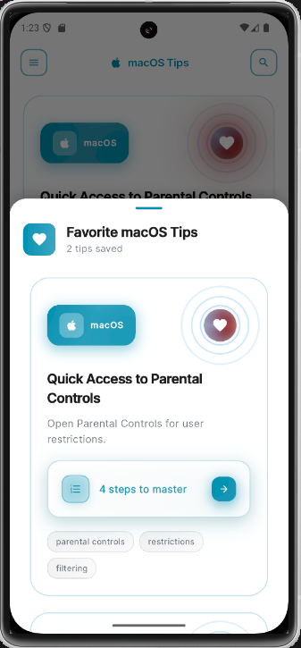

## Getting Started with Development

This project is built with Flutter. To get started:

1. Make sure you have Flutter installed (https://docs.flutter.dev/get-started/install)
2. Clone this repository
3. Run `flutter pub get` to install dependencies
4. Run `flutter run` to launch the app on a connected device or emulator

For more information on Flutter development:

- [Lab: Write your first Flutter app](https://docs.flutter.dev/get-started/codelab)
- [Cookbook: Useful Flutter samples](https://docs.flutter.dev/cookbook)
- [Flutter documentation](https://docs.flutter.dev/)
